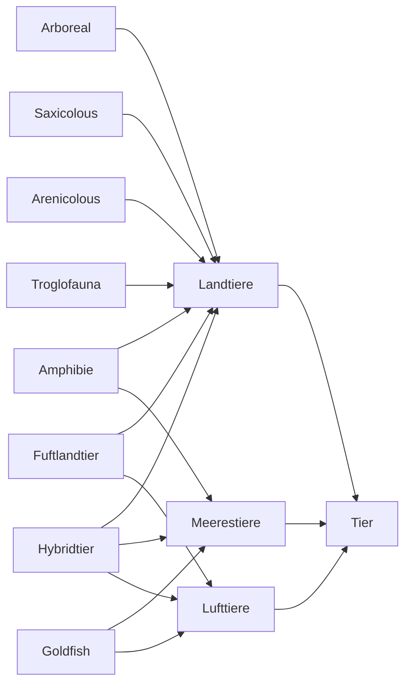

# Graph

```mermaid
graph LR;

Landtiere --> Tier
Arboreal    --> Landtiere
Saxicolous  --> Landtiere
Arenicolous --> Landtiere
Troglofauna --> Landtiere

Meerestiere  --> Tier
Amphibie --> Landtiere
Amphibie --> Meerestiere

Lufttiere  --> Tier
Fuftlandtier --> Landtiere
Fuftlandtier --> Lufttiere

Goldfish --> Meerestiere
Goldfish --> Lufttiere

Hybridtier --> Landtiere
Hybridtier --> Meerestiere
Hybridtier --> Lufttiere
```